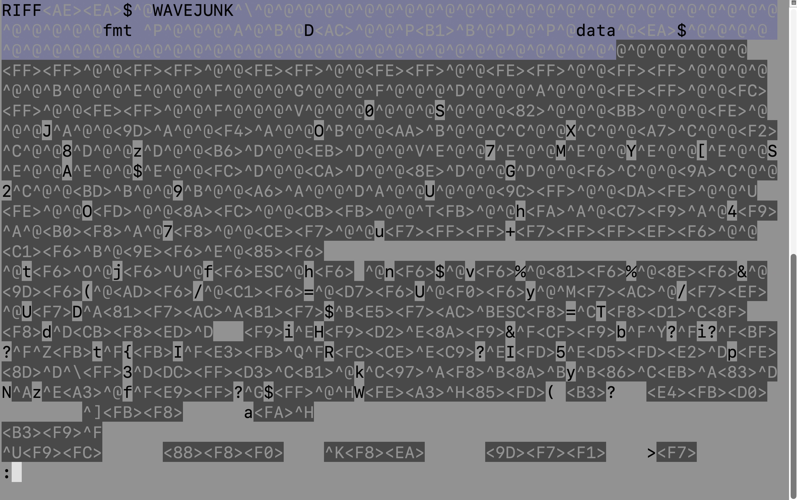
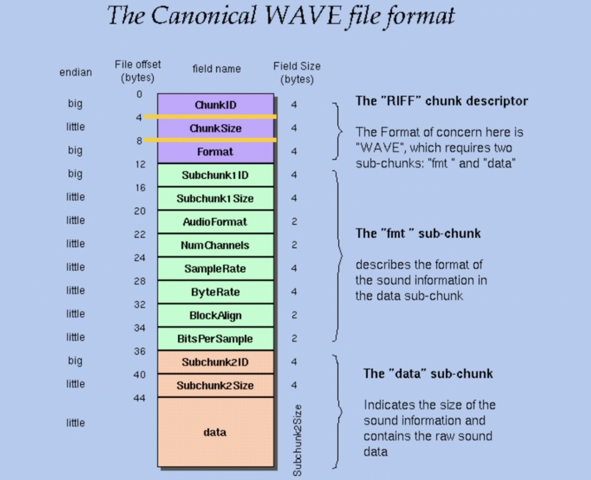

# wav-parser
### A WAV file parser built from scratch using Python's `struct` module

No external dependencies.

*Built as part of my doctoral research in computational psychiatry and biomedical informatics.*

---

Speech data has become central to Computational Psychiatry research in recent years. The physics of sound creates opportunity to extract more features that reveal information beyond baseline linguistic information: PTSD may cause more pauses and hesitation in speech, an anxious person may speak at a higher pitch... In general, voice quality may change shape under cognitive load or emotional pressure. Clinicians do these things intuitively; on the other hand, in objective computation, the quality of analysis depends on the integrity of the data (audio file).

The PCM encoding method and WAV file format is preferred for speech analysis because the data remains close to original from source and features are not lost to compression. Sound waves in the form of longitudinal air pressure waves are captured by a microphone and converted to voltage signals by a transducer. To become computable, this continuous voltage signal is captured in snapshots at regular intervals and quantized by the analog to digital converter (ADC), then recorded as binary digits on the computer's memory chip, ready to be read.

The ultimate goal of analysis is to extract meaningful acoustic features from the speech signal, but before that, saved speech data has to be processed. Fundamentally, we are first interested in knowing the baseline status, so we look for information such as the size of the audio file, the format, sample rate, and if it was recorded as mono or stereo. This metadata gives us a starting point of how to better understand and handle our data.

Various modules exist for parsing a wav file, notably the Python Wave module. It is quite simple to use by calling functions like `wave.open()` and `getframerate()`. While abstractions help to make work faster, if you are in a niche such as audio engineering or speech signal processing, it might be a useful literacy move to take a peek under the hood and uncover how these tools work. This project builds a wav file parser from scratch using only Python's [`struct`](https://docs.python.org/3/library/struct.html) module to get the specifications of an input wav file.

[sample.wav](sample.wav)

---
## What the wav parser does:

Reads a WAV file in binary mode and extracts:

- Container format (RIFF)
- File size
- Audio encoding (PCM = 1)
- Number of channels
- Sample rate
- Byte rate
- Block alignment
- Bit depth
- Number of audio frames
- Duration in seconds
- Raw PCM audio bytes

Handles JUNK chunks, which audio software sometimes inserts between the RIFF header and the fmt subchunk as padding.

---

## sample.wav binary

```bash
$ less sample.wav
```



The labels `RIFF`, `WAVE`, `JUNK`, `fmt`, and `data` are readable as ASCII. Everything else is binary data interpreted through the RIFF specification.

---

## The WAV file format

A WAV file is a RIFF container. RIFF organizes data into named chunks. Each chunk has a 4-byte ID, a 4-byte size field, and then its data. WAV requires two subchunks: `fmt ` (metadata) and `data` (raw audio).



All numeric fields are little-endian. Chunk ID labels are big-endian ASCII text.

---

## Usage

```bash
python3 wav_parser.py
```

Runs on `sample.wav` included in this repo.

---

## Limitations

- File path is currently hardcoded to `sample.wav`
- Assumes a JUNK chunk exists between the RIFF header and the `fmt` subchunk. Will break on wav files without one.
- Flat script with no class structure.
- No error handling on chunk ID decoding yet.

---

## Stack

- Python 3
- `struct` (standard library)
- No external dependencies

---

## Sample output

```
chunk id:  RIFF
chunk size:  2419374
riff format:  WAVE
junk:  JUNK
junk size:  28
subchunk1 id:  fmt
subchunk1 size:  16
audio format:  1
number of channels:  2
sample rate:  44100
byte rate:  176400
block align:  4
bits per sample:  16
subchunk2 id:  data
subchunk2 size:  2419200
number of frames:  604800
duration in seconds:  13.714285714285714
raw audio data:  b'\x00\x00\x00\x00\x00\x00\x00\x00\x00\x00'
```
